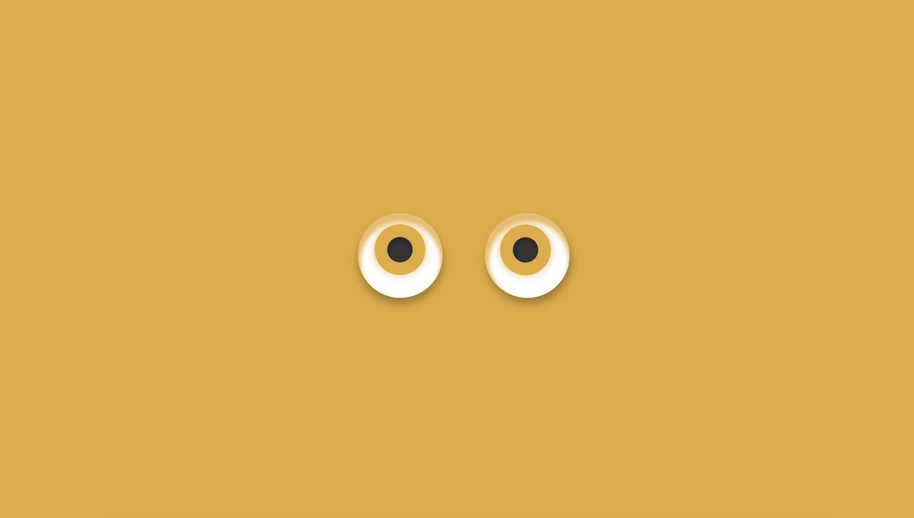

# 眼球跟随鼠标移动效果

* 鼠标移动事件
* `Math.atan2()`函数
* `Element.getBoundingClientRect()`API使用
* js修改伪元素样式
* 弧度 与 角度 的转换

> [Element.getBoundingClientRect()](https://developer.mozilla.org/zh-CN/docs/Web/API/Element/getBoundingClientRect) 返回元素的大小及其相对于视口的位置

## 效果图
